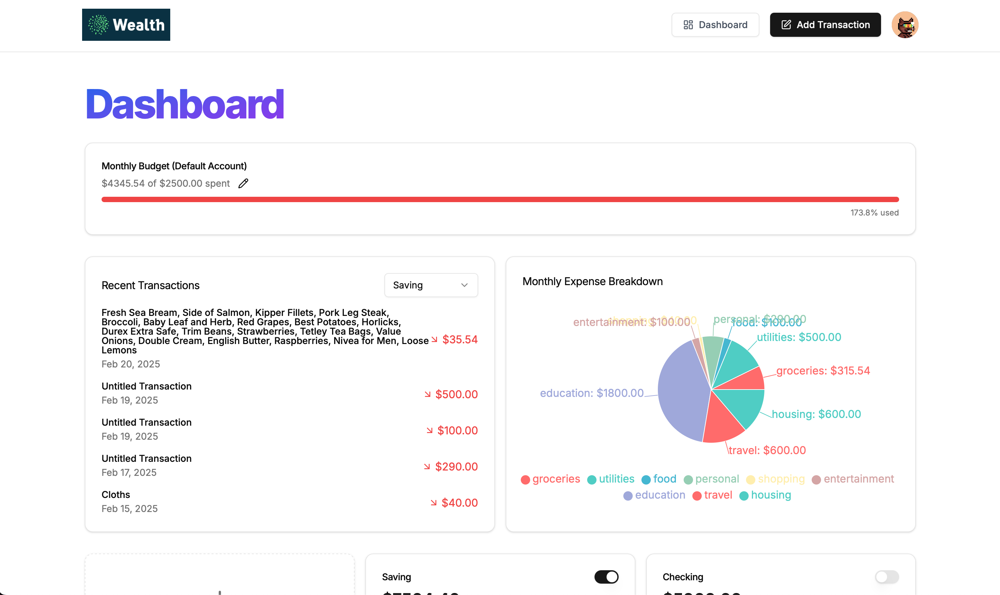
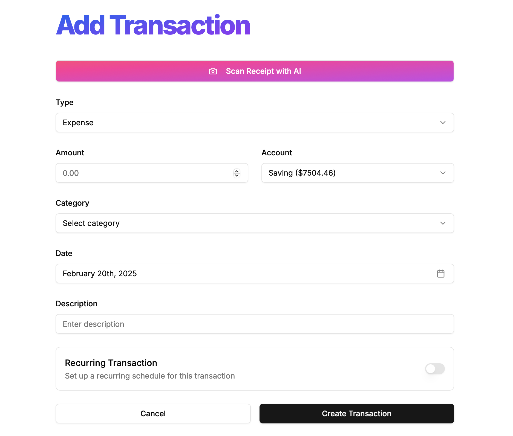
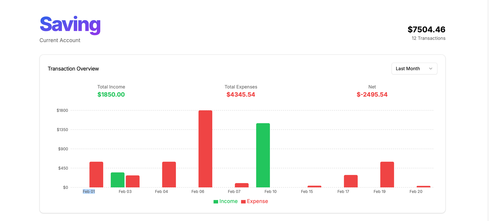
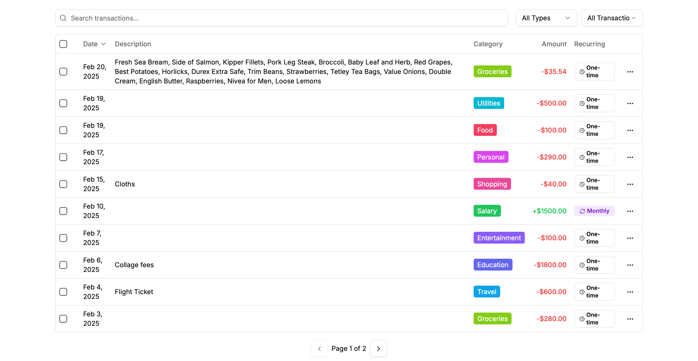
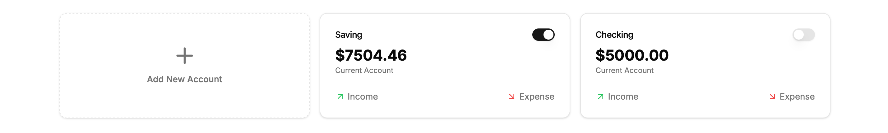
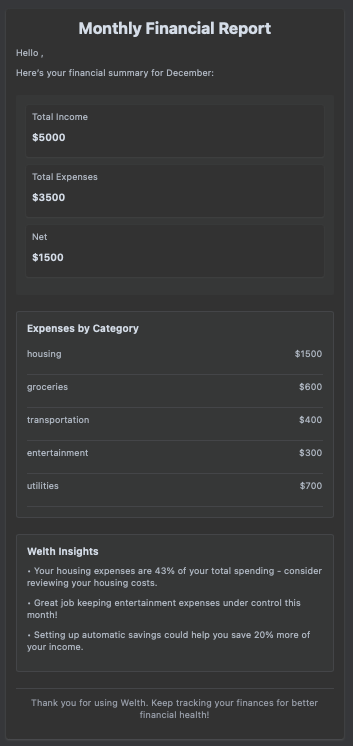

<div align="center">
  <br>
  
  <h1> AI-wealth-management </h1>
  <strong>💰 AI-powered wealth management web app—securely link multiple bank accounts, track transactions with receipt uploads, set budgets, and receive personalized AI-driven monthly reports based on past data.</strong>
</div>

### ⚙️ Tech Stack

## Frontend  
- **Next.js** – React-based framework for server-side rendering and static site generation.  
- **Tailwind CSS** – Utility-first CSS framework for styling.  
- **Recharts** – Data visualization library for charts.  
- **React Hook Form** – Form management library for better performance and validation.  
- **Zod** – Schema validation library for forms and API responses.  

## Backend & Database  
- **Next.js API Routes** – Server-side logic within the Next.js framework.  
- **Prisma** – ORM for database management.  
- **Inngest** – Background job processing and workflows.  

## AI & Automation  
- **Google Generative AI** – AI-powered insights for financial analysis.  
- **Resend** – Transactional email service for notifications.  
- **React Email** – Email template design and rendering.  

## Authentication & Security  
- **Clerk.js** – Authentication and user management.  

This tech stack enables a **scalable, AI-powered wealth management** web app with **secure authentication, advanced analytics, and a seamless user experience.** 🚀








## 🖥️ Local development

To install the application:

```shell
npm i --legacy-peer-deps
```

To start a local copy of the app on port `3000`:

```shell
npm run dev
```

Add this environment variables before starting this project

```shell
<!-- firebase credentials -->
NODE_ENV=
DATABASE_URL=
DIRECT_URL=
NEXT_PUBLIC_CLERK_PUBLISHABLE_KEY=
CLERK_SECRET_KEY=
NEXT_PUBLIC_CLERK_SIGN_IN_URL=/sign-in
NEXT_PUBLIC_CLERK_SIGN_UP_URL=/sign-up
NEXT_PUBLIC_CLERK_AFTER_SIGN_IN_URL=/onboarding
NEXT_PUBLIC_CLERK_AFTER_SIGN_UP_URL=/onboarding
GEMINI_API_KEY=
RESEND_API_KEY=
ARCJET_KEY=
ARCJET_ENV=
```